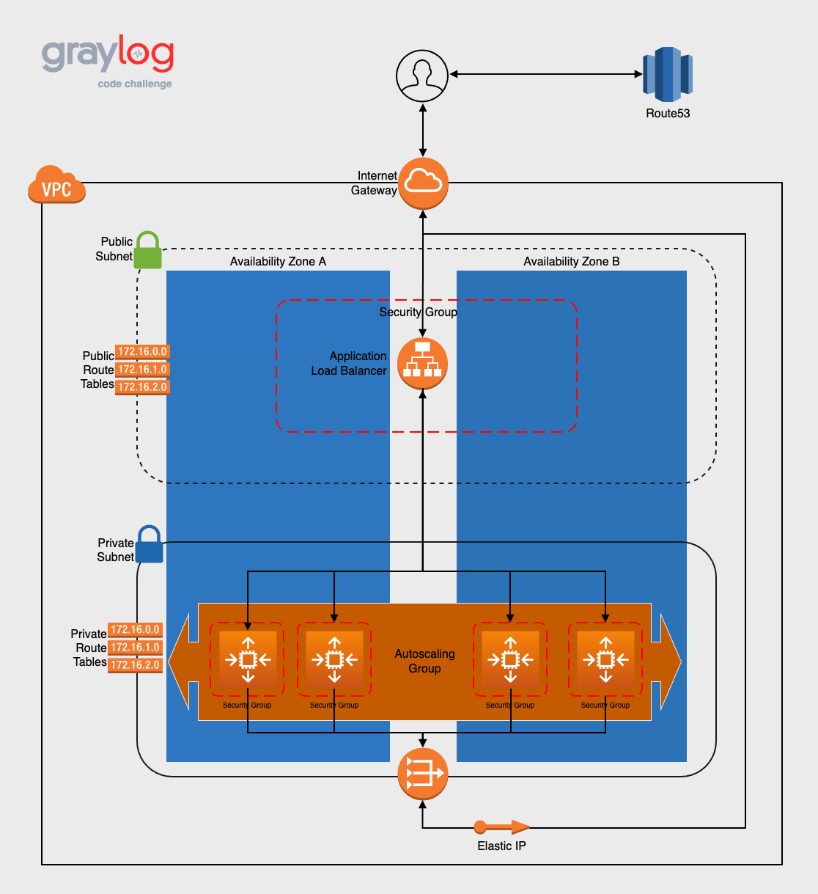

## Graylog Cloud Engineer Code Challenge


## Description
- The graylog_challenge_ec2 repository allows the user to provision and deploy a simple yet highly-available application in AWS
- There are several steps that need to be taken prior to launching the application that will be discussed
- The repository is broken down into several directories to make development and navigation easier:
  - [app](app/): contains the Dockerfile and hello-graylog Python application
  - [env](env/): contains the environment files used to customize the provisioning and deployment
  - [infra](infra/): contains the Terraform files (IaC) used to provision the underlying infrastructure
    - [templates](infra/templates): contains the user data template script that is executed on EC2 instances


### Repository Layout
      .
      ├── app                 # Lightweight containerized python app
      ├── env                 # Environment setup files
      ├── infra               # Terraform templates (IaC)
      │     └── templates     # User data template
      └── README.md
---
### Provisioned Infrastructure 
  - Route53
    - "A" Record DNS Entry
  - VPC
    - Subnets (public and private)
    - NAT Gateway + Elastic IP
    - Internet Gateway
    - Route Tables (public and private)
    - Security Groups
      - Internet --> Public subnet (port 443)
      - Public subnet --> Private subnet
      - 443 <--> ALB <--> 443
      - 443 --> EC2 Instances 
    - Application Load Balancer
    - EC2 Instances
    - Autoscaling Group + Launch Template

---
### Infrastructure Diagram


---

## Deployment
#### Prerequisites
 
- ##### Required Packages
    | Name | Version |
    |------|---------|
    | <a href="https://learn.hashicorp.com/tutorials/terraform/install-cli">terraform</a>           |  1.0.11 |
    | <a href="https://docs.aws.amazon.com/cli/latest/userguide/getting-started-install.html">aws-cli</a>  | >= 2.4.17 |

- ##### User/Instance Privileges
  - This repository code can be executed on a local development host or from an EC2 instance sitting in a management VPC
  - Local development environment: The credentials (Access Key and Secret) need the proper IAM policies attached
  - EC2 Instance or Fargate Container: Need the proper roles attached to the instance

- ##### Variables
    - Update the following variables in the [env/.tfvars](env/.tfvars:10) file:

      | Variable Name | Line No. | Example |
      | --- | --- | --- |
      | `region`                  | 21 | us-west-1 |
      | `availability_zones`      | 25 | ["us-west-1a", "us-west-1c"] |
      | `certificate_arn`         | 30 | arn:aws:acm:us-north-1:123456789:certificate/1234567890-abcd|
      | `route53_zone_id`         | 34 | Z1234567890ABCDEFG |
      | `route53_dns_record_name` | 38 | hello-graylog.fakedomain.com |

  - Notes:
    - Use the following code snippets to find the following variables:
      - certificate_arn: `aws acm list-certificates`
      - route53_zone_id: `aws route53 list-hosted-zones`
    - The Certificate ARN has to be a wildcard certificate (e.g. *.fakedomain.io)
    - The Certificate ARN also has to belong to the same region as the `region` variable
    - The route53_dns_record_name root domain (e.g. fakedomain.com) should be registered in the account prior to code execution
    - Verify that none of the defined CIDR blocks or naming conventions will interfere with existing infrastructure

#### Provisioning Infrastructure
```BASH
# Clone the repository to your local machine or host
$ git clone https://github.com/falterfriday/graylog_challenge_ec2.git

# Change directory into the cloned repository's infra directory
$ cd graylog_challenge_ec2/infra

# Initialize the Terraform working directory
$ terraform init

# Display planned Terraform infrastructure
$ terraform plan -var-file ../env/.tfvars

# Execute Terraform provisioning
$ terraform apply -var-file ../env/.tfvars
```

#### Access
- Once the infrastructure has been provisioned successfully, the command line will display the FQDN (e.g. graylog.fakedomain.com) where the application can be accessed via web browser
- Note: Upon completion, it can take up to 15 minutes for DNS to propagate 
  - During this time the URL may not be reachable
- It can be accessed through the application load balancer's DNS on port 443 or by adding the `https://` prefix
  - `alb-graylog-1167174764.us-east-1.alb.amazonaws.com:443`
  - or
  - `https://lb-graylog-1167174764.us-east-1.alb.amazonaws.com`


#### Destroy Infrastructure
```BASH
# Change directory into the cloned repository's infra directory
$ cd graylog_challenge_ec2/infra

# Destroy Terraform infrastructure
$ terraform destroy -var-file ../env/.tfvars
```

---
### Contact Information
- Patrick Todd
- <patrick.a.todd@gmail.com>
- +1 206-661-2890